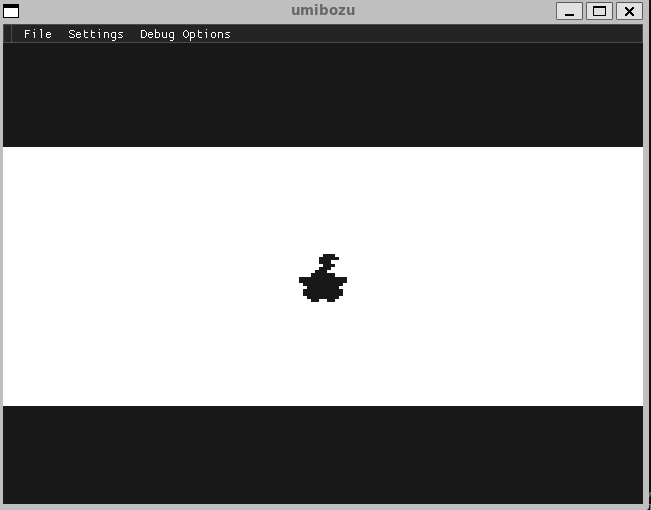
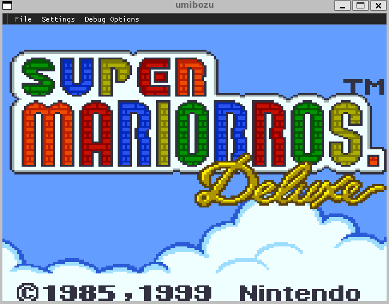
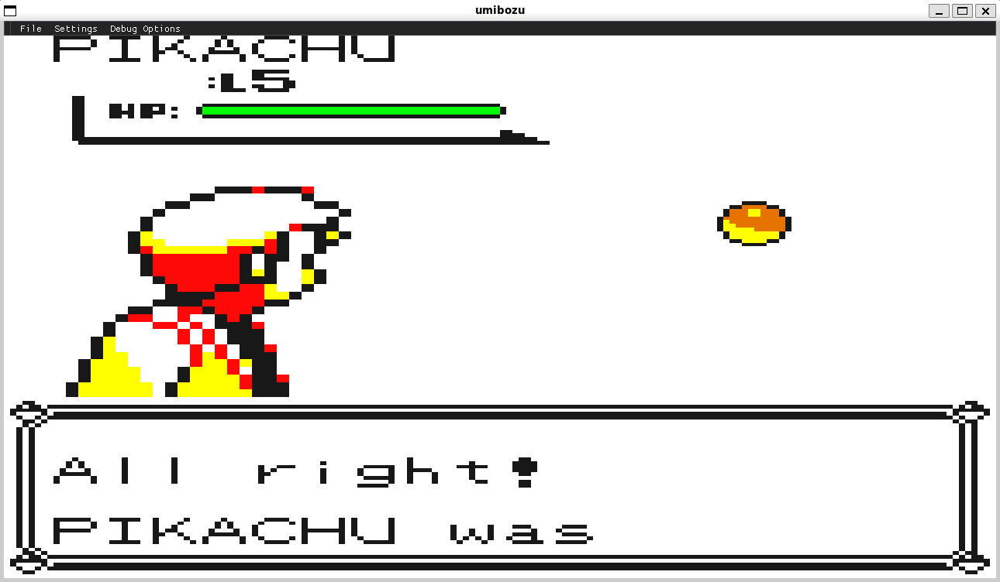

# [Umibozu](https://en.wikipedia.org/wiki/Umib%C5%8Dzu)

Gameboy Color emulator written in C++20
Supports both Game Boy and Game Boy Color games!

As of right now, this emulator only supports Linux. 

You can try building it on Windows, it *should* work, as I don't use any compiler specific extensions.

[Screenshots](#Screenshots)

## Accuracy

This emulator is far from cycle-accurate. It was not developed with accuracy in mind, nevertheless, most games are playable!

## Mappers

Support all mainline mappers:

- [x] ROM ONLY
- [x] MBC1
- [x] MBC3 w/ RTC (incl. MBC30 up to 512 ROM banks!)
- [x] MBC5

## why?

This is my first project I've ever written in C++.

you might be asking: "there are so many gameboy emulators out there! why make *another one*?"

the reason i'm making this is to **learn!**

i've always been intrigued by how emulators work, this would be an awesome learning experience. at the same time, this project will also be used to learn C++.

## Resources

I used the following resources to create this emulator:

### [Pan Docs](https://gbdev.io/pandocs/)
### [E. Haskins (DAA instruction)](https://ehaskins.com/2018-01-30%20Z80%20DAA/)
### [sm83-test-data](https://github.com/adtennant/sm83-test-data)

# Controls
| Original | Keyboard |
|----------|---------------------|
| Down     |  Down Key           |
| Up       | Up Key              |
| Left     | Left Key            |
| Right    | Right Key           |
| Start    | Enter               |
| Select   | BACKSPACE           |
| B        | X                   |
| A        | Z                   |

Don't like the controls? You can rebind them in the settings.

## Binaries

Binaries are available in the Releases tab.

## Known Issues

- [ ] Pokemon Crystal seems to have graphical artifacts when interacting with NPCs -- DMA related
- [ ] The window in games might get scrolled (Health indicator in DK3)
- [ ] Games that make use of Double Speed (Shantae, DK Country) suffer from severe graphical artifacting -- *probably* DMA related.

## Issues
Did you run into a crash/bug? Feel free to open a ticket, and I'll have a look.

## Screenshots

